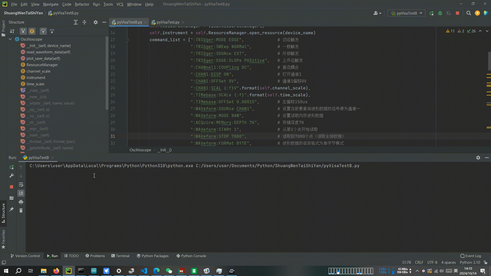

# PyScopeRead

Use Python to control an uin-trend oscilloscope with SCPI in USB, read its data, and then freely do some things.

<a>Keywords:</a> <i>Python; USB; SCPI; Oscilloscope; Uni-trend;</i>
<h1>1. Application</h1>
  
1. Programmable reading of oscilloscope signals at specified timing.

  
2. Perform Fourier transform, display, and store data.

  
3. More other operations, such as building datasets for deep learning.

  <a>The UNI-T official programming guide see:</a><a herf="https://instruments.uni-trend.com.cn/static/upload/file/20240313/UPO1000X%E6%95%B0%E5%AD%97%E8%8D%A7%E5%85%89%E7%A4%BA%E6%B3%A2%E5%99%A8%E4%B8%AD%E6%96%87%E7%BC%96%E7%A8%8B%E6%89%8B%E5%86%8CREV.1(2023.pdf">instruments.uni-trend.com</a>

<h1>2. Devices & Link</h1>
<h2>1. Devices</h2>
<table>
  <thead>
    <tr>
      <th>Id</th>
      <th>Name</th>
      <th>Model</th>
    </tr>
  </thead>
  <tr>
    <td>1</td><td>PC</td><td>Win10 with Python 3.10</td>
  </tr>
  <tr>
    <td>2</td><td>oscilloscope</td><td>UPO1202S-E</td>
  </tr>
  <tr>
    <td>3</td><td>one-chip computer</td><td>ESP32</td>
  </tr>
  <tr>
    <td>4</td><td>object</td><td>/</td>
  </tr>
</table>
<h2>2. Link</h2>

As shown in the following figure

<h1>3. Demo</h1>

As shown in the following gif

